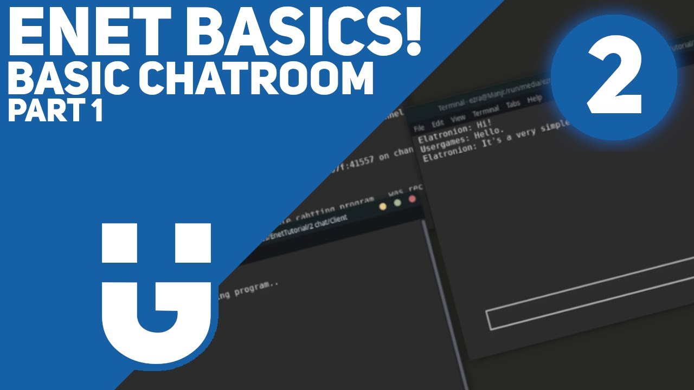
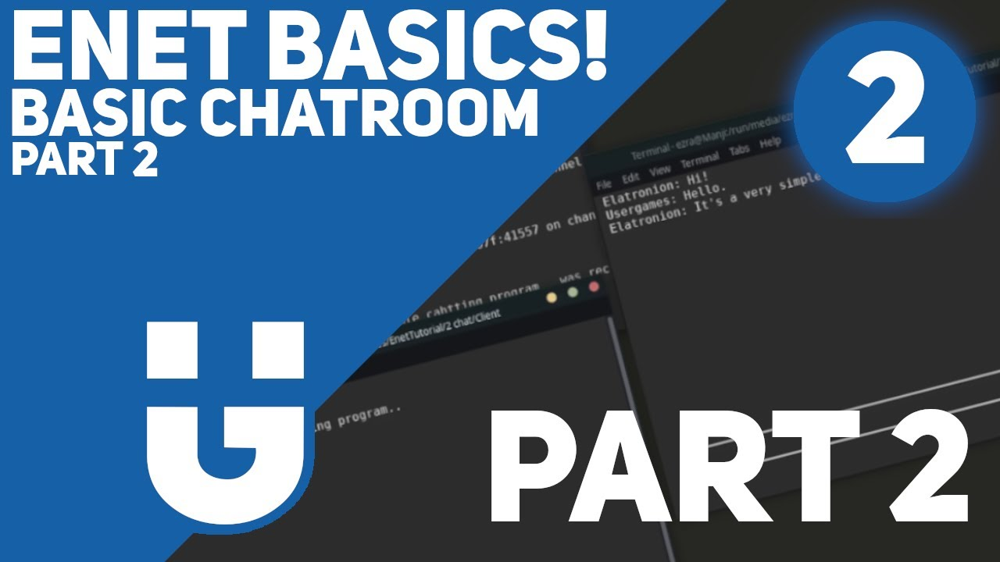

[previous](./basic-enet-tutorial-series-part1-introduction.md) | [next](#)

# ENet Tutorial Series!


[](https://www.youtube.com/embed/lWlZOTFW5lM)

[](https://www.youtube.com/embed/lWlZOTFW5lM)

## Creating A Basic Chatting Program

Now that we know how to set up a client and a server, it would be nice if we could send packets between them to do.. Well, anything. What better way to learn than to create a chatting program!

## Setting Up

We will be building upon the code we wrote last time.
So, if you haven't already, we suggest you read the first part.
I'll use **ncurses** as the backbone of this terminal based chatting app, but I will not be explaining everything that I've done.. If you wish to follow step by step exactly what I did, then you can download the files here:

- [chat_screen.hpp](./files/chat_screen.hpp)
- [chat_screen.cpp](./files/chat_screen.cpp)

I've kept them completly sperated from everything else so that we can focus on the subject in hand: ENet.

> ⚠️ **Important Note!**
> 
> We never suggest anyone to do `while(true)`!
That said, we used it to showcase ENet code more and software architecture less.
Perhaps we will modify this in the future.

To use my `ChatScreen` class, start by adding the files to your project. Afterwards, you can set up everything with the following code: 

```cpp
/* ./client/main.cpp */

#include <iostream>
#include <string>
#include "chat_screen.hpp"

static ChatScreen chatScreen; // Create static chatscreen object

int main(int argc, char ** argv)
{
	// User Can Set Their Username
	printf("Please Enter Your Username?\n");

	// Variable that will store username
	char username[80];

	// Put User input into 'username'
	scanf("%s", &username);

	chatScreen.Init(); // Initialize the chatScreen
	while(true) // Game Loop
	{
		std::string msg = chatScreen.CheckBoxInput(); // Get (and wait for) input from screen
		chatScreen.PostMessage("username", msg.c_str()); // Puts user input into chat log (displays on screen)
	}

	return EXIT_SUCCESS;
}
```

We might make a ncurses tutorial in the future, but for now just see this as a magic box.     
It's not important for you to understand ncurses for this tutorial.

## Code

> ℹ️ **Note!** 
> 
> We will be using C++. This will help simplify the tutorial... The advanced series will most likely be in C.

### ./client/main.cpp

Last time we created a client, we didn't keep track of any data. ENet kept track of who was connected to the server, but that's about it. Now that we are creating something a little more complicated, we will need to actually keep track of some data. I'll do this by creating a class, but it can just as well be done with a struct.

```cpp
// The Client's data will be managed by this class
class ClientData
{
	private:
	int m_id;
	std::string m_username;

	public:
	ClientData(int id) : m_id(id) {}

	void SetUsername(std::string username){ m_username = username; }

	int GetID(){ return m_id; }
	std::string GetUsername(){ return m_username; }
};
```

You'll notice that we will keep track of two things here. The client's username and id. Okay, the username that makes sense, but what about this 'id'?
Well, this will be a number giving to the client by the server and is a way for clients to keep track of other clients. Given the fact that the server is already plenty aware of what the various clients are doing, it won't need the id. It is truly only for our clients to synchronize. 

Next, we will create a `std::map` of the clients, that way we can grab the client we want by their id and not their position in an array.
This will require you to include map.

```cpp
// A std::map of all clients that are currently connected.
std::map client_map; // id, ClientData*
```

And we mustn't forget, a simple way to send packets to a peer! (the server in this case)

```cpp
// A simple way to send packets to a peer
void SendPacket(ENetPeer* peer, const char* data)
{
	// Create the packet using enet_packet_create and the data we want to send
	// We are using the flag ENET_PACKET_FLAG_RELIABLE that acts a bit like TCP.
	// That is to say, it'll make sure the packet makes it to the destination.
	ENetPacket* packet = enet_packet_create(data, strlen(data) + 1, ENET_PACKET_FLAG_RELIABLE);

	// Finally, send the packet to the peer on channel 0!
	enet_peer_send(peer, 0, packet);
}
```

For now we've hard coded it to always send packets that are `ENET_PACKET_FLAG_RELIABLE` on channel 0, but in the final part of this tutorial series, we will changing this.
You'll notice that we do `strlen(data) + 1` this states the size of the data we want to send, the length of the str data + 1 (because strings end with '\0'). 

```cpp
// The main function
int main(int argc, char ** argv)
{
	// User set username
	printf("Please Enter Your Username?\n");
	char username[80];
	scanf("%s", &username);

	// Normal enet initialization (see part 1)
	if(enet_initialize() != 0)
	{
		fprintf(stderr, "An error occurred while initializing ENet!\n");
		return EXIT_FAILURE;
	}
	atexit(enet_deinitialize);

	ENetHost* client;
	client = enet_host_create(NULL, 1, 1, 0, 0);

	if(client == NULL)
	{
		fprintf(stderr, "An error occurred while trying to create an ENet client host!\n");
		return EXIT_FAILURE;
	}

	ENetAddress address;
	ENetEvent event;
	ENetPeer* peer;

	enet_address_set_host(&address, "127.0.0.1");
	address.port = 7777;

	peer = enet_host_connect(client, &address, 1, 0);
	if(peer == NULL)
	{
		fprintf(stderr, "No available peers for initiating an ENet connection!\n");
		return EXIT_FAILURE;
	}

	if(enet_host_service(client, &event, 5000) > 0 &&
		event.type == ENET_EVENT_TYPE_CONNECT)
	{
		puts("Connection to 127.0.0.1:7777 succeeded.");
	}
	else
	{
		enet_peer_reset(peer);
		puts("Connection to 127.0.0.1:7777 failed.");
		return EXIT_SUCCESS;
	}

	// Send The Server The User's Username
	char str_data[80] = "2|";
	strcat(str_data, username);
	SendPacket(peer, str_data);

	// Init the chatScreen
	chatScreen.Init();

	while(true)
	{
		std::string msg = chatScreen.CheckBoxInput();
		chatScreen.PostMessage(username, msg.c_str());

		char message_data[80] = "1|";
		strcat(message_data, msg.c_str());
		SendPacket(peer, message_data);
	}

	// Disconnect peer from server
	enet_peer_disconnect(peer, 0);

	while(enet_host_service(client, &event, 3000) > 0)
	{
		switch(event.type)
		{
			case ENET_EVENT_TYPE_RECEIVE:
				enet_packet_destroy(event.packet);
				break;
			case ENET_EVENT_TYPE_DISCONNECT:
				puts("Disconnection succeeded.");
				break;
		}
	}

	return EXIT_SUCCESS;
}
```

Woah woah woah! That's a big chunk of code, ain't it? Well, don't worry about it too much, most of it we've already written in the first part of this series. But we have added some new things. First, we added the chat_screen logic, we already know how that works. Second, we are using our new SendPacket function to send the username to the server.. But, something seems odd. Why are we concatenating "2|" to our username before sending it?

```cpp
// Send The Server The User's Username
char str_data[80] = "2|";
strcat(str_data, username);
SendPacket(peer, str_data);
```

To start, we first need to understand that when we send a packet to any peer, they are unaware of what the packet is suppost to do. Like a file without an extension. We must find a way to identify the mission of the packet. Thus, 2 in this case is a identifier that will tell the server that this packet is a username. 

Same goes for the packets we send in our while loop.

```cpp
char message_data[80] = "1|";
strcat(message_data, msg.c_str());
SendPacket(peer, message_data);
```

Although, the id is `1` in this case.

> ℹ️ **Note!** 
> 
> This is a simplification of proper practices. I parse complete string to visualise the data that is being sent, obviously it would be much more optimized if we were to send raw data!
i.e. reserving the first byte as the identifier whilst keeping the rest of the data the same.

You'll also notice that we use `"|"` to divide the different segments of data. This is an arbitrary character chosen for this tutorial.

If you are astute, you may have noticed that we aren't receiving any data. Let's fix this.

> ⚠️ **Important Note!**
> 
> The way we set up ncruses does not allow us to run anycode whilst waiting for input (which we do all the time in a loop)
Our solution is multithreading. This isn't necessarily bad, but definitly more advanced that we wanted to show for this tutorial.
In a normal application, you'd just have the receiving code be in the game loop along side everything else.

First, we'll include `pthread.h` then at the top, under our includes, we'll add `static int CLIENT_ID = -1;`
This will keep track of our client's id.
Next, we'll create a void pointer `MsgLoop` that will be a function with it's own game loop in a sepereate thread.

```cpp
void* MsgLoop(ENetHost* client)
{
	while(true)
	{
		ENetEvent event;
		while(enet_host_service(client, &event, 0) > 0)
		{
			switch(event.type)
			{
				case ENET_EVENT_TYPE_RECEIVE:

					ParseData(event.packet->data); // Parse the receiving data.
					enet_packet_destroy(event.packet);
					break;
			}
		}
	}
}
```

We have a special function here. One we are yet to create..
`ParseData` that takes the data of any received packet and, well, parses it.
Let's see how that is done.

> ℹ️ **Note!** 
> 
> Packets received by the client will have an extra argument. They will come with the id of the client that sent out the data.
> That is to say, if we send `"2|myname"` the server will receive this and re-transmit the packet with the client's id. If my id is 5, everyone will receive `"2|5|myname"`.

```cpp
void ParseData(char* data)
{
	// Will store the data type (e.g. 1, 2, etc)
	int data_type;

	// Will store the id of the client that is sending the data
	int id;

	// Get first two numbers from the data (data_type and id) and but them in their respective variables
	sscanf(data,"%d|%d", &data_type, &id);

	// Switch between the different data_types
	switch(data_type)
	{
		case 1: // data is a message
			if(id != CLIENT_ID)
			{
				// Get message and Post it using the ClientData at id's username and the parsed msg.
				char msg[80];
				sscanf(data, "%*d|%*d|%[^|]", &msg);
				chatScreen.PostMessage(client_map[id]->GetUsername().c_str(), msg);
			}
			break;
		case 2: // data is a username
			if(id != CLIENT_ID)
			{
				// Create a new ClientData with username and add it to map at id.
				char username[80];
				sscanf(data, "%*d|%*d|%[^|]", &username);

				client_map[id] = new ClientData(id);
				client_map[id]->SetUsername(username);
			}
			break;
		case 3: // data is our ID.
			CLIENT_ID = id; // Set our id to the received id.
			break;
	}
}
```

Ok, going back to the main game loop, we now need to create our thread.
Before the loop starts, we'll create the thread.

```cpp
// Create a thread for receiving data
pthread_t thread;
pthread_create(&thread, NULL, MsgLoop, client);
```

And after the game loop, we'll join in back in.

```cpp
// Join thread
pthread_join(thread, NULL);
```

### ./server/main.cpp

Oh, we're halfway there!
Now, it's time to work on ther server. Don't worry, there's no multithreading in this part.
Chunks of the code will be exactly the same as the client and server of the first part.

> ℹ️ **My Different Data IDs!** 
> 1. Message
> 2. Username
> 3. Server Given ID
> 4. Disconnect

```cpp
#include <iostream>
#include <enet/enet.h>

#include <string>
#include <cstring>
#include <map>

class ClientData
{
	private:
		int m_id;
		std::string m_username;

	public:
		ClientData(int id) : m_id(id) {}

	void SetUsername(std::string username){ m_username = username; }

	int GetID(){ return m_id; }
	std::string GetUsername(){ return m_username; }
};

std::map<int, ClientData*> client_map;

void BroadcastPacket(ENetHost* server, const char* data)
{
	ENetPacket* packet = enet_packet_create(data, strlen(data) + 1, ENET_PACKET_FLAG_RELIABLE);
	enet_host_broadcast(server, 0, packet);
}

void SendPacket(ENetPeer* peer, const char* data)
{
	ENetPacket* packet = enet_packet_create(data, strlen(data) + 1, ENET_PACKET_FLAG_RELIABLE);
	enet_peer_send(peer, 0, packet);
}

void ParseData(ENetHost* server, int id, char* data)
{

	int data_type;
	sscanf(data, "%d|", &data_type);

	switch(data_type)
	{
		case 1:
		{
			char msg[80];
			sscanf(data, "%*d|%[^\n]", &msg);

			char send_data[1024] = {'\0'};
			sprintf(send_data, "1|%d|%s", id, msg);
			BroadcastPacket(server, send_data);
			break;
		}
		case 2:
		{
			char username[80];
			sscanf(data, "2|%[^\n]", &username);

			char send_data[1024] = {'\0'};
			sprintf(send_data, "2|%d|%s", id, username);

			BroadcastPacket(server, send_data);
			client_map[id]->SetUsername(username);

			break;
		}
	}
}

int main(int argc, char ** argv)
{
	if(enet_initialize() != 0)
	{
		fprintf (stderr, "An error occurred while initializing ENet.\n");
		return EXIT_FAILURE;
	}
	atexit(enet_deinitialize);

	ENetAddress address;
	ENetHost* server;
	ENetEvent event;

	address.host = ENET_HOST_ANY;
	address.port = 7777;

	server = enet_host_create(&address, 32, 1, 0, 0);

	if(server == NULL)
	{
		fprintf(stderr, "An error occurred while trying to create an ENet server host!\n");
		return EXIT_FAILURE;
	}

	// GAME LOOP START
	int new_player_id = 0; // An auto incrementing variable to give to any new clients
	while(true)
	{

		while(enet_host_service(server, &event, 1000) > 0)
		{
			switch(event.type)
			{
				case ENET_EVENT_TYPE_CONNECT:
				{
					printf("A new client connected from %x:%u.\n",
							event.peer -> address.host,
							event.peer -> address.port);

					for(auto const& x : client_map)
					{
						char send_data[1024] = {'\0'};
						sprintf(send_data, "2|%d|%s", x.first, x.second->GetUsername().c_str());
						BroadcastPacket(server, send_data);
					}

					// Increment new_player_id with each new connection
					new_player_id++;
					client_map[new_player_id] = new ClientData(new_player_id);
					event.peer->data = client_map[new_player_id];

					char data_to_send[126] = {'\0'};
					sprintf(data_to_send, "3|%d", new_player_id);
					SendPacket(event.peer, data_to_send);

					break;
				}
				case ENET_EVENT_TYPE_RECEIVE:
				{
					printf ("A packet of length %u containing %s was received from %x:%u on channel %u.\n",
							event.packet -> dataLength,
							event.packet -> data,
							event.peer -> address.host,
							event.peer -> address.port,
							event.channelID);

					ParseData(server, static_cast<ClientData*>(event.peer->data)->GetID(), event.packet->data);
					enet_packet_destroy(event.packet);
					break;
				}
				case ENET_EVENT_TYPE_DISCONNECT:
				{
					printf("%x:%u disconnected.\n",
							event.peer -> address.host,
							event.peer -> address.port);

					char disconnected_data[126] = {'\0'};
					sprintf(disconnected_data, "4|%d", static_cast<ClientData*>(event.peer->data)->GetID());
					BroadcastPacket(server, disconnected_data);

					event.peer->data = NULL;
					break;
				}
			}
		}

	}
	// GAME LOOP END

	enet_host_destroy(server);

	return EXIT_SUCCESS;
}
```

We have a variable, `int new_player_id = 0;`, that is the ID we will send out to any new connections.

`BroadcastPacket` is very similar to `SendPacket`, only difference being who the data is sent to.
`SendPacket` will send the packet to a defined peer. `BroadcastPacket` will send the packet to every connect peer.

```cpp
void BroadcastPacket(ENetHost* server, const char* data)
{
	ENetPacket* packet = enet_packet_create(data, strlen(data) + 1, ENET_PACKET_FLAG_RELIABLE);
	enet_host_broadcast(server, 0, packet);
}
```

## That's it!

You've done great to make it this far!
Hopfully we didn't jump too much, but we didn't want to repeat ourselves.
Consider it an exercise!

Next up, creating a multiplayer game! (putting it all together)

[previous](./basic-enet-tutorial-series-part1-introduction.md) | [next](#)

© Copyright 2020, Ezra Hradecky ([CC BY-SA 4.0](https://creativecommons.org/licenses/by-sa/4.0/)).
